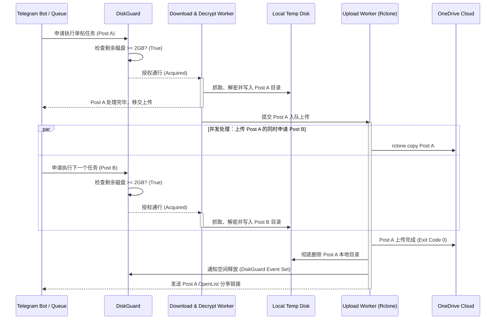

# 系统架构与核心机制技术文档 (Architecture & Core Mechanics)

本文档深入阐述系统的技术选型、分层架构、并发管道机制、解密流程以及防爆盘安全保护机制。

---

## 1. 架构总览与分层设计

系统由 **三层架构** 组成：

```
+-------------------------------------------------------------+
|                      1. Telegram 交互层                     |
|  - Aiogram v3 (Async Event Dispatcher & Long Polling)       |
|  - 权限拦截中间件 (User ID Whitelist Guard)                  |
|  - 交互状态机 (FSMContext for Author Page Selector)         |
+-------------------------------------------------------------+
                              |
                              v
+-------------------------------------------------------------+
|                      2. 核心调度与解析层                     |
|  - 动态域名探活器 (Domain Resolver via hjw2026.com)          |
|  - 海角解析引擎 (Haijiao Parser / Post & Author Fetcher)     |
|  - 多媒体流式解密器 (AES-128 HLS / Obfuscated Image Decrypt) |
|  - Markdown 排版生成器 (Markdown + Relative Assets Builder)  |
|  - 磁盘自适应门禁 (DiskGuard: Capacity & Semaphore Control)  |
+-------------------------------------------------------------+
                              |
                              v
+-------------------------------------------------------------+
|                      3. 上传、清理与链接映射层               |
|  - Rclone 异步子进程上传器 (Async Subprocess Executor)       |
|  - 成功校验与即时磁盘清理器 (Atomic Local FS Cleaner)        |
|  - OpenList URL 映射与 Telegram 回调生成器                  |
+-------------------------------------------------------------+
```

---

## 2. 核心模块工作机制

### 2.1 动态域名探测机制 (`core/resolver.py`)

1. **提取与过滤**：
   - 异步请求发布页 `https://hjw2026.com`，使用 BeautifulSoup / 正则提取所有包含 `http` 的有效镜像节点。
2. **并发探活测速**：
   - 对每个候选域名发起轻量并发 `HEAD` / `GET` 探测（设置 5s 超时）。
   - 过滤掉 404/5xx 及不可达节点，按照响应延时由低到高排序。
3. **缓存与故障重探**：
   - 最优可用域名写入内存缓存，TTL 默认为 6 小时。
   - 当爬虫在后续请求中遇到网络异常、SSL 阻断或特定错误状态码时，立即触发失效重探逻辑，自动切换为备用活跃域名。

---

### 2.2 媒体流式解密机制 (`core/decryptor.py`)

1. **图片解密**：
   - 针对部分带签名防盗链或混淆文件头的图片流，进行二进制头部还原或指定对称密钥解密。
   - 通过校验文件前 4 字节的 Magic Number（如 `0xFF 0xD8 0xFF` 为 JPEG，`0x89 0x50 0x4E 0x47` 为 PNG），确保解密后落盘文件的有效性。
2. **视频切片解密与合并**：
   - 获取 `.m3u8` 播放列表，解析 `#EXT-X-KEY:METHOD=AES-128,URI="..."` 中的密钥地址与 IV 向量。
   - 采用 `asyncio.gather` 分块并发拉取加密 `.ts` 切片，并在内存中进行 AES-128-CBC 解密。
   - 解密后的流写入本地临时缓冲文件，并调用 `ffmpeg`（或内置二进制流拼装）无损封装为标准的兼容性 `.mp4` 文件。

---

### 2.3 篇级双工流水线与 DiskGuard (`core/disk_guard.py` & `core/pipeline.py`)

在紧凑型 VPS（如 10GB 磁盘）场景下，为兼顾吞吐量与防爆盘，采用**篇级双工流水线模型**：



- **挂起拦截逻辑**：若下载某大容量帖子导致 VPS 剩余磁盘不足 `MIN_FREE_DISK_GB`，后续帖子的 `DiskGuard.acquire()` 会自动 `await` 挂起，直到前面的帖子上传完毕并释放磁盘空间。
