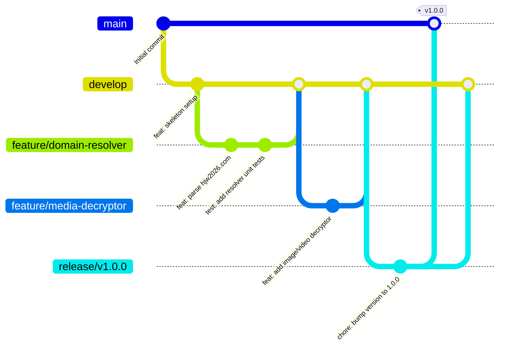

# Git Flow 本地与协作工作流指南 (Git Flow Workflow Guide)

本文档定义了本项目 (`haijiao-downloader-telegram`) 的分支策略、开发流程、提交规范与发布生命周期。

---

## 1. 分支模型设计 (Branching Model)

项目采用经典的 **Git Flow** 工作流模型，包含以下两类长期分支和三类短期分支：



### 1.1 长期分支 (Long-lived Branches)

| 分支名 | 作用说明 | 保护策略 |
| :--- | :--- | :--- |
| `main` | **生产就绪分支**。存储随时可发布到 VPS 运行的稳定版本。每次合并必须打版本 Tag（如 `v1.0.0`）。 | 禁止直接 push，仅接受经测试验证后的 Merge。 |
| `develop` | **集成开发分支**。存储最新的已完成开发特性，是所有功能分支的起点和汇聚点。 | 团队日常开发集成分支。 |

### 1.2 短期分支 (Short-lived Branches)

| 分支类型 | 命名规则 | 起始分支 | 合并目标 | 作用 |
| :--- | :--- | :--- | :--- | :--- |
| **Feature** (特性) | `feature/<feature-name>` | `develop` | `develop` | 开发新功能或子系统模块（如 `feature/disk-guard`） |
| **Bugfix** (缺陷修复) | `bugfix/<issue-name>` | `develop` | `develop` | 修复在 `develop` 阶段发现的缺陷 |
| **Release** (发布准备) | `release/vX.Y.Z` | `develop` | `main` & `develop` | 封版、修正版本号、更新变更日志并打 Tag |
| **Hotfix** (紧急修复) | `hotfix/vX.Y.Z-patch` | `main` | `main` & `develop` | 针对生产环境严重漏洞或故障的紧急修复 |

---

## 2. 本地开发标准操作步骤

### 2.1 初始化本地仓库与分支

```bash
# 1. 初始化并建立 main 分支
git init -b main

# 2. 建立并切换到 develop 分支
git checkout -b develop
```

### 2.2 开发新功能 (Feature Branch)

```bash
# 1. 从最新的 develop 切出功能分支
git checkout develop
git pull origin develop  # (若有远端)
git checkout -b feature/dynamic-resolver

# 2. 进行代码开发并编写测试...
# 3. 运行本地验证与测试
pytest tests/

# 4. 提交代码 (遵循 Conventional Commits 规范)
git add src/core/resolver.py tests/test_resolver.py
git commit -m "feat(resolver): implement dynamic domain discovery from hjw2026.com"

# 5. 合并回 develop 分支
git checkout develop
git merge --no-ff feature/dynamic-resolver

# 6. 删除本地已完成的 feature 分支
git branch -d feature/dynamic-resolver
```

### 2.3 版本发布流程 (Release)

```bash
# 1. 从 develop 切出 release 分支
git checkout -b release/v1.0.0

# 2. 修正版本号、更新 CHANGELOG.md 等元数据
git commit -am "chore(release): prepare release v1.0.0"

# 3. 合并到 main 并打 tag
git checkout main
git merge --no-ff release/v1.0.0
git tag -a v1.0.0 -m "Release version 1.0.0"

# 4. 同步合并回 develop 分支
git checkout develop
git merge --no-ff release/v1.0.0

# 5. 删除 release 分支
git branch -d release/v1.0.0
```

---

## 3. Commit Message 规范 (Conventional Commits)

所有提交信息需采用统一格式：

```
<type>(<optional scope>): <subject>

[optional body]

[optional footer(s)]
```

### 3.1 Type 类别清单

- `feat`: 新增业务功能（如 `feat(bot): add interactive author page range selection`）
- `fix`: 修复 Bug（如 `fix(decryptor): fix aes key padding error on ts stream`）
- `docs`: 文档变更（如 `docs: add deployment guide for vps`）
- `style`: 代码格式调整（不影响逻辑，如空格、缩进）
- `refactor`: 重构代码（非新增功能且非修复缺陷）
- `perf`: 性能优化（如内存降低、提升解密吞吐）
- `test`: 增加或修改测试用例
- `chore`: 构建配置、依赖更新、辅助脚本修改

### 3.2 规范示例

- `feat(disk-guard): implement adaptive pause when disk free space < 2GB`
- `fix(uploader): ensure local directory is cleaned only on rclone exit code 0`
- `docs(specs): update architecture document for post-level pipeline`
